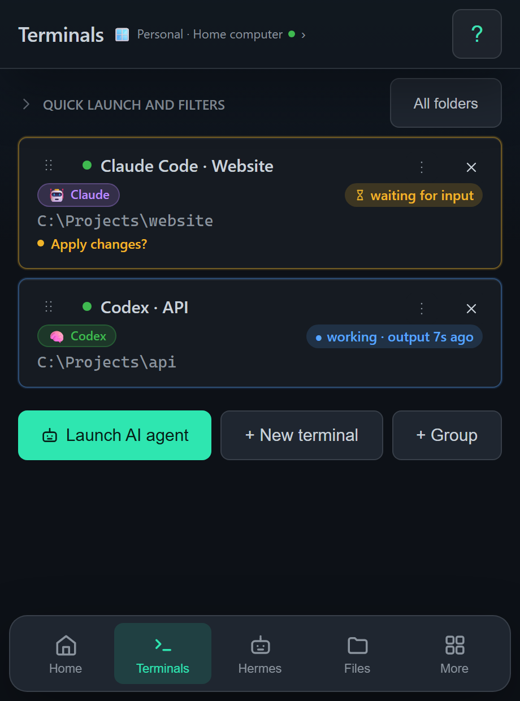

# Remotai

**English** · [Русский](README.ru.md)

Access the terminals and AI agents on your computer from your phone or browser.
Remotai brings together remote terminals, files, computer screen access, SSH,
and multiple devices. Desktop releases are available for Windows, macOS and
Linux; the client runs in a browser and on Android. Screen features vary by OS.

[Download the latest release](https://github.com/great105/remotai-open/releases/latest)
· [Self-hosting guide](docs/self-hosting.en.md)
· [Managed service](https://remotai.ru)

**The source code and self-hosted deployment are free.** Run your own server,
or use the official managed Remotai service with a cloud subscription.
You pay for your own infrastructure and AI providers separately.

| Option | Getting started | What you pay for |
|---|---|---|
| Your own server | Build the agent and start Docker Compose | Your infrastructure and chosen AI services |
| Managed Remotai | [Open the service](https://remotai.ru) | The Remotai cloud subscription; AI services are billed separately |

The application, website and deployment guide support English and Russian.
Choose your language on the sign-in screen or in Settings → Help and privacy.
The choice is saved on your device. Self-hosting does not require a payment
provider; the managed service currently uses Russian payment methods.



## Run your own server

You need Docker Compose, Node.js 22+, a domain and open ports 80/443.
Clone the source, then run these commands from the repository root:

```bash
git clone https://github.com/great105/remotai-open.git
cd remotai-open
node scripts/init-self-hosted.mjs https://remotai.example.com
docker compose --env-file deploy/self-hosted/.env -f deploy/self-hosted/compose.yaml up -d --build
```

Replace `https://remotai.example.com` with your domain. Open its `/app/` page.
TLS is configured automatically. A Telegram bot and SMTP are optional for the
first connection. See the **[deployment guide](docs/self-hosting.en.md)** for
local setup, persistent sign-in, updates and backups.

## Build an agent for your server

Install Go 1.25+ and Node.js 22+. On the computer you are building for,
use PowerShell on Windows or a shell on Linux/macOS:

```bash
npm ci
node scripts/build-self-hosted.mjs https://remotai.example.com
```

The output is `build/remotai-self-hosted.exe` on Windows or
`build/remotai-self-hosted` on Linux/macOS. The script only builds the agent.

Pair your Windows computer:

```powershell
.\build\remotai-self-hosted.exe pair --relay https://remotai.example.com
```

On Linux/macOS:

```bash
./build/remotai-self-hosted pair --relay https://remotai.example.com
```

Enter the generated code in your server's web client. To install startup
integration on the target computer, run `install --no-pair` before pairing.
Self-hosted builds are not replaced by official automatic updates.

The ready-made downloads in Releases use the official service by default.
Use the build instructions above for an agent configured for your own relay.

## Repository layout

| Path | Contents |
|---|---|
| `cmd/tgcontrol/`, `internal/` | Go agent: terminals, files, screen access and local API |
| `apk/` | React/Vite/Capacitor browser and Android client |
| `packages/shared/` | Shared types, API, components and translations |
| `tgcontrol-relay/` | Relay and accounts, with a separate Go module |
| `deploy/self-hosted/` | Docker Compose, relay/client builds and Caddy |
| `scripts/` | Source builds and checks |

For a separate web client, set `VITE_RELAY_BASE` to your relay origin and
`VITE_BASE=/app/`, then run `npm run build:apk`.
For Android, build with `VITE_BASE=/`, run `npx cap sync android` from `apk/`,
and use your own signing key. Official app signing keys are not included.

## Checks

```bash
npm test
# Build the agent first to generate the embedded web client:
go test ./cmd/... ./internal/...
# Relay:
cd tgcontrol-relay
go test ./...
```

## License and brand

Remotai source code is available under **[AGPL-3.0](LICENSE)**.
You can use, study and self-host it for free, including for commercial use,
subject to the license. When you offer a modified version over a network,
make its corresponding source available to its users as the license requires.

Dependencies retain their own licenses. Use your own identity for a public
third-party service: see the [brand rules](TRADEMARKS.en.md).
The official managed cloud remains a separate paid product.
